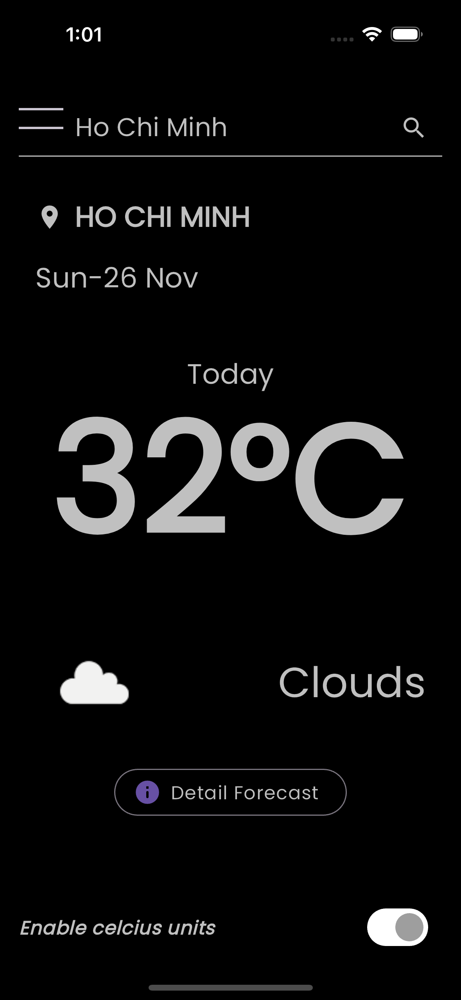
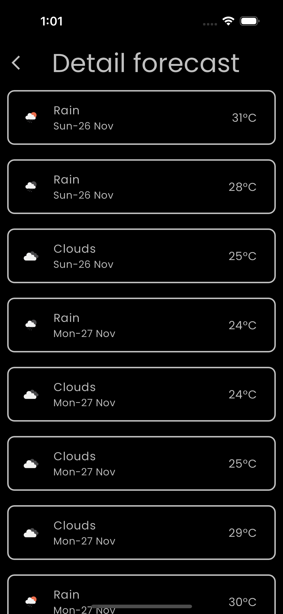

# Weather App Documentation

## Application UI
| App UI | Test Results |
| --------- | ---------- |
|  |  |


## Application features

The Weather App is designed to provide real-time weather updates with a simple and user-friendly interface. To use the app:

1. **Search Weather:** Search weather by seach bar
2. **Show Current Weather:** data on the HomePage.
3. **Display the forecast:** for the next few days in the Forecast Detail Page view.

## Additional Features

1. **Pull-to-refresh**
2. **Toggle Unit:** Switch between Celsius and Fahrenheit temperature units.
3. **Geolocation:** Implement functionality to fetch the user's current location and display weather accordingly.


## App Structure

App structure, the cubit/ directory within the weather/ folder indicates that are using a simplified version of the BLoC pattern, known as Cubit. The main difference is that Cubit is a lighter and simpler way to manage state without the full complexity of streams that come with a full BLoC implementation.

By adhering to the BLoC pattern, app is more maintainable and scalable, which is advantageous if you plan to add more features in the future or need to handle more complex state management scenarios.

## Run and build app

1. **Navigate to your project directory**:
   ```sh
   cd path/to/your/weather_app
   ```
2. **API Key config**:
   To get an API key, sign up here:
   https://home.openweathermap.org/users/sign_up

   Then paste it in `api_keys.default.dart`  and rename this file to `api_keys.dart`.

   You can also specify an API Key via --dart-define. Example:
   ```
   "flutter run --dart-define API_KEY=YOUR_API_KEY
   ```
   
3. **Get all the dependencies**:
   ```sh
   flutter pub get
   ```
   This command fetches all the necessary Flutter packages defined in your `pubspec.yaml` files.

4. **Run the build_runner**:
   ```sh
   flutter pub run build_runner build
   ```
   This step will generate code for your project using the build_runner package. This is commonly used for projects that use code generation for features like JSON serialization.

5. **Check that an emulator is running or a device is connected**:
   ```sh
   flutter devices
   ```
   This command lists all available devices or emulators.

6. **Run the app**:
   ```sh
   flutter run
   ```
   This command builds the app and installs it on the connected device or emulator. If you have multiple devices available, you might need to specify the device ID with the `-d` flag.

Optional steps if you encounter any issues:

- **Clean the build**:
  ```sh
  flutter clean
  ```
  Sometimes build-related problems can be resolved by cleaning the project.

- **Run tests to ensure your app is working correctly**:
   ```sh
   flutter test
   ```
   This will run any unit or widget tests you've written in the `test/` directory.

> **Note:** Make sure to run `flutter pub run build_runner build` whenever you make changes to files that require code generation. If you want to watch for changes and automatically generate code, you can replace `build` with `watch` in the build_runner command.

## Contact

If you have any issues or questions, feel free to reach out to me at [coduy96@gmail.com](mailto:coduy96@gmail.com).